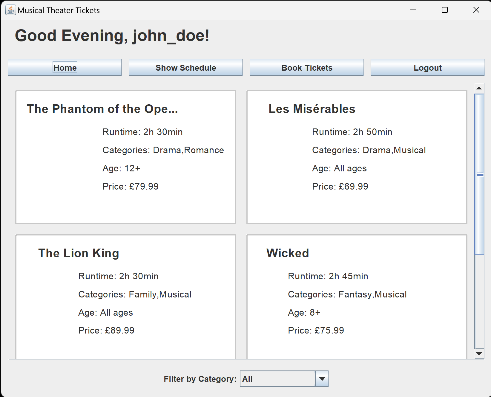
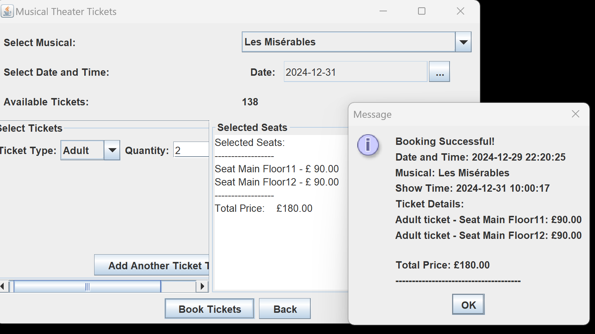
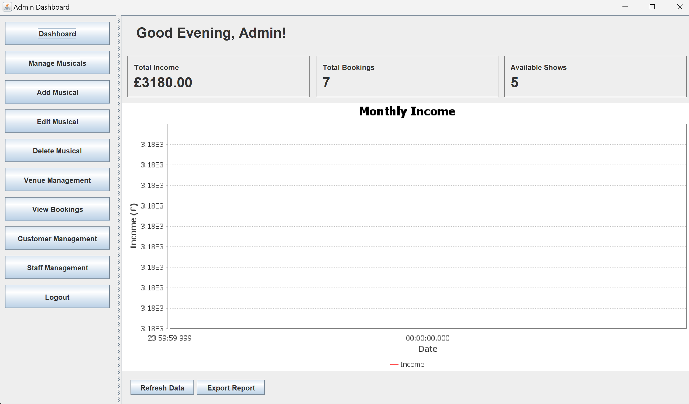
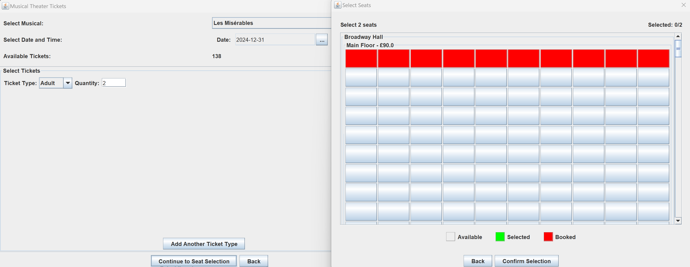

# 🎭 Musical Theater Ticket Booking System
A comprehensive Java-based desktop application for booking musical theater tickets, featuring an intuitive GUI and robust ticket management system.

## ✨ Features
### Core Functionality
- **Interactive GUI** with multi-panel navigation
- **Musical Catalog** with detailed show information
- **Category Filtering** for easy show browsing
- **Dynamic Schedule Display** with available show times
- **Smart Ticket Management** with real-time availability tracking
- **Flexible Pricing System** with automatic discounts
- **Day Availability Checker** to validate show schedules
- **Digital Receipt Generation** with timestamp and booking details

### Technical Features
- **MySQL Database Integration** for robust data management
- **Object-oriented design**
- **Responsive Swing GUI**
- **Real-time validation**
- **Error handling and user feedback**
  
## 📸 Screenshots
<i> Not to worry, this UI will change in due time 😅. Currrently focusing more on functionality.</i>

<details>
	<summary>View screenshots</summary>
    <p align="left">
        
        
        
        
    </p>
</details>

<br/>

## 🛠️ Prerequisites
- Java Development Kit (JDK) 17 or higher
- Any Java IDE (Eclipse, IntelliJ IDEA, or NetBeans)
- MySQL Server 8.0 or higher
- MySQL Connector/J JDBC Driver

## 🎯 Future Enhancements
<i>In this section, completed or achieved features so far will be marked with `✔️`</i>
### Planned Features
- **Online Payment Integration** 💳
- **User Authentication System** 🔐 `✔️`
- **Email Confirmation** 📧
- **Mobile-Responsive Design** 📱 `✔️`
- **Seat Selection Interface** 💺 `✔️`
- **Season Pass Management** 🎫
- **Group Booking Discounts** 👥
- **Loyalty Program** ⭐
- **Show Reviews & Ratings** ⭐
- **Multi-language Support** 🌐

### System Improvements
- Database integration for robust data management `✔️`
- API implementation for third-party integrations
- Performance optimization for large-scale bookings `✔️`
- Enhanced security features `✔️`
- Automated backup system
- Analytics dashboard `✔️`

## 🔍 Additional Features Needed
<i>In this section, completed or achieved features so far will be marked with `✔️`</i>
1. **Venue Management** `✔️`
   - Seating layout visualization `✔️`
   - Section-based pricing `✔️`
   - Capacity management `✔️`

2. **Customer Management**
   - Customer profiles `✔️`
   - Booking history
   - Preferences tracking

3. **Administrative Features**
   - Staff access controls `✔️`
   - Sales reporting `✔️`
   - Inventory management
   - Show management interface `✔️`

4. **Marketing Integration**
   - Promotional code system
   - Email marketing integration
   - Social media sharing

5. **Support System**
   - Ticket cancellation
   - Refund processing
   - Customer service interface

## 📦 Installation (Follow carefully)

1. Clone the repository:
```bash
git clone https://github.com/AlvinCoded/theater-ticket-booking-system.git
```

2. Navigate to the project directory:
```bash
cd theater-ticket-booking-system
```

3. Set up MySQL Database by importing `musical_tickets.sql`.

4. Add MySQL Connector and the other required JARs to project:
- Download MySQL Connector/J, JCommon, JDatePicker, Joda Time and JFreeChart from their official websites
- Create a `lib` folder in the project root
- Place the `mysql-connector-java-*.jar`, `jcommon-*.jar`, `jdatepicker-*.jar`, `joda-time-*.jar` and `jfreechart-*`,  in the `lib` folder

5. Configure database connection:
- Open MusicalDataHandler.java
- Update the following constants with your MySQL credentials:
```java
private static final String DB_URL = "jdbc:mysql://localhost:3306/musical_tickets";
private static final String USER = "your_username";
private static final String PASS = "your_password";
```

6. Compile and run the application:
```bash
javac -cp "lib/*:." FinalGUI.java
java -cp "lib/*:." FinalGUI
```

For Windows, use semicolons instead of colons:
```bash
javac -cp "lib/*;." FinalGUI.java
java -cp "lib/*;." FinalGUI
```

## Some IDE-Specific Setup
<i>Repeat these steps for the other required library JARs</i>
### Eclipse
1. Right-click on project → Properties → Java Build Path
2. Click "Add External JARs"
3. Navigate to lib folder and select mysql-connector-java-*.jar

### IntelliJ IDEA
1. File → Project Structure → Libraries
2. Click + → Java
3. Navigate to lib folder and select mysql-connector-java-*.jar

### NetBeans
1. Right-click on project → Properties → Libraries → Add JAR/Folder
2. Navigate to lib folder and select mysql-connector-java-*.jar

## 🤝 Contributing

Contributions are welcome! Please feel free to submit a Pull Request.

## 📝 License

This project is licensed under the Apache License 2.0.

## 🙏 Acknowledgments

- Java Swing documentation
- JCommon documentation
- JDatePicker documentation
- Joda Time documentation
- JFreeChart documentation
- JavaFX documentation

---
⚠️ **Note**: This project uses MySQL for data persistence. Ensure MySQL Server is running and properly configured before launching the application. For production use, additional security measures and features would be necessary.
